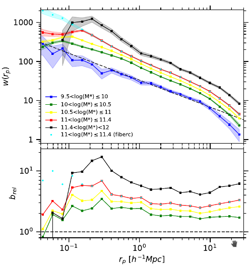
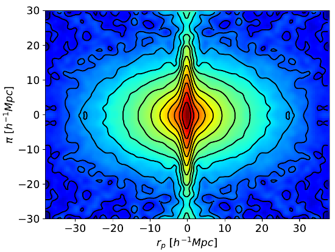

# 

[](<https://lincc-ppt.readthedocs.io/en/latest/>)
[](<https://pypi.org/project/gundam/>)
[](<https://gundam.readthedocs.io/>)
[](<https://github.com/lincc-frameworks-mask-incubator/gundam/actions/workflows/smoke-test.yml>)
[](<https://codecov.io/gh/lincc-frameworks-mask-incubator/gundam>)

A package to count galaxy pairs at light speed and estimate 2-point correlation functions 
of large galaxy samples or mock catalogs, that works with angular, projected and
redshift-space coordinates. Its main features are:

* **Speed**  
By calling Fortran routines that implement efficient skip-list/linked-list algorithms,
it can be extremely fast  
* **Parallel**  
Employs the OpenMP framework to make use of multi-core CPUs  
* **User-defined Weights and Error Estimates**  
Accepts weighted pair counts defined by the user and can also estimate statistical
boostrap errors with minimal overhead  
* **User-friendly and Flexible**  
By carefully wrapping Fortran code in a suitable Python framework, it is very easy to use and extend its functionality by both novice and seasoned users  
* **Bonus Track**  
Lots of auxiliary and plotting functions to produce nice, paper-ready plots for 
1D/2D correlations, complete with ratios, labels and even power-law fits  

## Getting Started
Input data consists of astropy tables (see [Astropy Tables](http://docs.astropy.org/en/stable/table/)), 
which provides an excellent I/O framework for a variety of formats (ASCII, VOTable, FITS tables, etc.)

Gundam also employs special dictionaries (see [Munch](https://pypi.python.org/pypi/munch))
to pack multiple parameters or output fields at once. Such dictionaries have
attribute-like access with dot notation. If you are used to ipython's dot+tab 
completion you will love this.

A typical usage workflow consists of:
1. Read data into astropy tables, usually one table for the "data" sample and 
another one for the "random" sample.
2. Create and customize a dictionary for input parameters (e.g. to set binning, 
cosmology, estimator, etc.)
3. Calculate the statistic (correlation function or simply the pair counts for a 
given geometry)

```
import gundam as gun
from astropy.table import Table

gals = Table.read('red_gals.fits')   # Read data
rans = Table.read('red_rans.fits')   # Read randoms
gals['wei'] = 1.                     # If there are no weights, just fill with 1's
rans['wei'] = 1.                     # If there are no weights, just fill with 1's

par = gun.packpars(kind='pcf')       # Get defaults for a proj. corr. function (pcf)
par.h0      = 69.5                   # Change H0
par.nsepp   = 24                     # Set 24 bins in projected separation
par.dsepp   = 0.1                    # Each of size 0.1 dex
par.estimator = 'LS'                 # Pick Landy-Szalay estimator 

c = gun.pcf(gals, rans, par, nthreads=4)   # Estimate pcf using 4 threads

c.qprint()                           # Quickly check the output fields (dd, rr, etc.)
gun.cnttable(c)                      # Or show counts in your browser
gun.cntplot(c)                       # Or plot the pcf
```

For further information please read-the-docs [here](https://readthedocs.org/projects/gundam/).
There is a very decent introduction so you can start using Gundam within 5 minutes,
and of course the full API.
    
## Example Runs
Data and code for 3 examples demonstrating typical use cases are provided in the 
repo (*example_lrg.py*, *example_pcf.py* and *example_redblue.py*). For the moment 
these are couple plots to illustrate what can be done with Gundam in just a few 
lines of code  

 &nbsp;&nbsp;&nbsp; 
    
### Prerequisites

You will need to have these:

* [Python 3.5 or later](http://www.python.org/)
* [GCC Compiler (C, Fortran & OpenMP support)](https://gcc.gnu.org/)
* [munch](https://pypi.python.org/pypi/munch)
* [pymorton](https://github.com/trevorprater/pymorton/) (optional, only needed
if experimenting with different orderings)


### Installing

To install Gundam, you have two choices: (1) use pip, or (2) build from scratch. 
Method (1) is useful if you simply want to use gundam. Method (2) on the other hand
allows easy access to modify or extend the Fortran counting routines. In any case, 
make sure to fulfill the required dependencies.

To install gundam via pip execute:

```
pip install gundam
```

If you want to contribute to the package, you need to clone the Gundam repository
and install with the "dev" optional dependencies.

```
git clone https://github.com/lincc-frameworks-mask-incubator/gundam.git
cd gundam
pip install -e .'[dev]'
pre-commit install
```

By default this will compile and build the library in-place. Feel free to modify 
the CMakeLists file to suit your needs.

## Contributing

Please read [CONTRIBUTING](CONTRIBUTING.md) for details on our code of conduct, and the process for submitting pull requests to us.

## Authors

* **Emilio Donoso** - ICATE-CONICET [(contact)](mailto:edonoso@conicet.gov.ar)

## License

This project is licensed under the MIT License - see the [LICENSE](LICENSE) file for details


