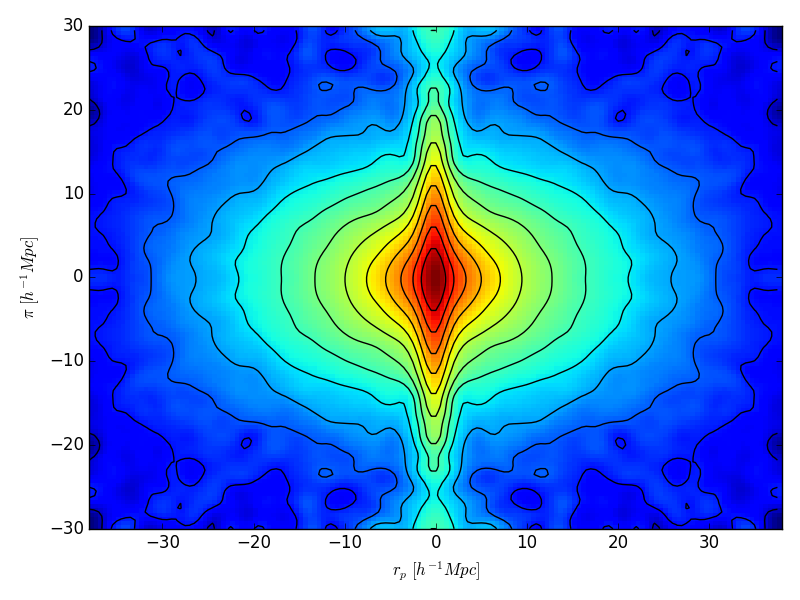
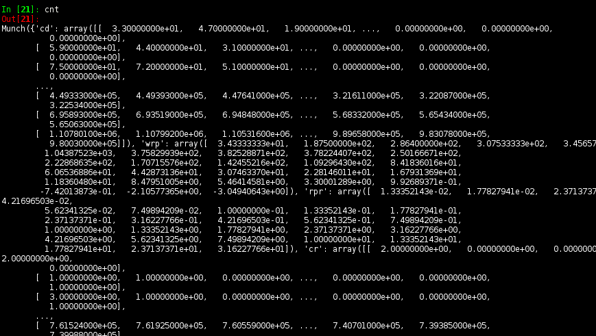

.. _introduction:

************
Introduction
************

1. Input Data
=============

Input data for the main routines are astropy tables (see `Data Tables <http://docs.astropy.org/en/stable/table/>`_), 
which provide  all the functionality to manipulate tabular data, and to read/write 
in a variety of formats (ASCII, VOTable, FITS tables, etc.)

These input tables should have columns for **at least** angular coordinates and 
weights, but note the default names of columns can be overridden so there is no need
to rename your original table (e.g. that infamous "RAJ_2000" instead of "ra"). 
Extra columns are welcome though as the name implies, are indeed extra and 
consume extra memory

+------------------+----------------------------------------------------------+
| Default name     | Description                                              |
+==================+==========================================================+
| ra,dec           | Right ascension and declination [deg]                    |
+------------------+----------------------------------------------------------+
| z                | Redshift (not needed in angular correlations)            |
+------------------+----------------------------------------------------------+
| wei              | Weight of source                                         |
+------------------+----------------------------------------------------------+
| dcom             | Comoving distance. Only used if ``calcdist=False``       |
+------------------+----------------------------------------------------------+

For example, data in FITS format can be read simply by

.. code-block:: python
    
    from astropy.table import Table
    gals = Table.read('redgals.fits')  # read data
    # If gals does not have a column for weights, just create one filled with 1's
    gals['wei'] = 1.0

2. Set Up Input Parameters
==========================

Since there are quite a few parameters to deal, Gundam employs a special 
dictionary (see `Munch <https://pypi.python.org/pypi/munch>`_) to pack and pass 
all of them at once. This dictionary also has attribute-like access with dot 
notation, meaning to access parameters you just type :code:`par.omegam` (print matter density), 
:code:`par.h0=100.` (set Hubble constant), etc. If you are used to ipython+tab
completion you will certainly love this.

While you can create an input parameter dictionary from scratch, it is far
easier to use :func:`gundam.packpars` to create a skeleton with default values,
and then customize it to your needs. For example

.. code-block:: python

    import gundam as gun
    par = gun.packpars(kind='pcf')    # Get defaults for a proj. corr. function
    par.h0    = 69.5      # Change H0 [km/s/Mpc]
    par.nsepp = 24        # Set 24 bins in projected separation [Mpc]
    par.dsepp = 0.1       # Each of size 0.1 dex
    par.estimator = 'LS'  # Pick Landy-Szalay estimator 

    # Can also specify values while creating the par object
    par2 = gun.packpars(kind='acf', outfn='/test/angularcf')

    # Quickly check all parameters by printing a nicely formated list
    par2.qprint()

    
3. Get Counts & Correlations
============================

Having read your data (`gals` and `rans`) and set up input parameters `par`, 
getting a projected correlation function is as easy as

.. code-block:: python

    cnt = gun.pcf(gals, rans, par, nthreads=1)

The output object ``cnt`` is, again, a Munch dictionary that holds the correlation
function ``cnt.wrp``, the projected bins mid-point ``cnt.rpm``, and many others.
Here we show that the data and random samples had ~84k and 400k galaxies,
respectively.

.. code-block:: python

    cnt.qprint()
    
    # =================  Projected Correlation  =================
    # Description :: Full projected autocorrelation
    # npt         :: 84383
    # npt1        :: 400000
    # rpl         :: [ 0.1 ... 1.58113882522 ... 16.8522765348 ]
    # rpm         :: [ 0.124173954464 ... 1.96336260485 ... 20.9261381905 ]
    # rpr         :: [ 0.148347908929 ... 2.34558638447 ... 24.9999998462 ]
    # wrp         :: [ 214.431631437 ... 22.5684208374 ... 4.51112595359 ]
    # wrperr      :: [ 20.4245915831 ... 1.15641601016 ... 0.435505255 ]
    # dd          :: [ 2082.0 ... 84.0 ... 26.0 ]
    #                [ ...  ... ]
    #                [ 1428490.29 ... 1136520.2 ... 823343.33 ]
    # rr          :: [ 1084.0 ... 918.0 ... 749.0 ]
    #                [ ...  ... ]
    #                [ 26894309.95 ... 22249661.39 ... 17933389.42 ]
    # ......
    
A plot is worth a thousand words, so let's do a good graphic of :math:`w(r_p)`
by typing :code:`gun.cntplot(cnt, factor=2.)` (the 2x factor is due to xxxx)
    
.. image:: cf01.png
    :scale: 70%
    :alt: Example plot of a projected correlation function

    
4. Going Parallel
=================

To speed things up, Gundam can count pairs in parallel using multiple cores. Just
set :code:`nthreads` as in 
   
    .. code-block:: bash
        
        cnt = gun.pcf(gals, rans, par, nthreads=8)
        
That's all. Under the hood, the software divides the counting process in several 
declinations stripes, computes the pairs in each, and adds everything up at 
the end. OpenMP threads are created and scheduled by the underlying Fortran code.

5. Typical Use Cases
====================

Check God's Fingers
-------------------

Gundam can calculate and plot 2D correlation functions in a few lines. Let's see 
a self-explanatory example for 100k luminous red galaxies from SDSS DR7 (included
in /examples directory) 

.. code-block:: python
    
    from astropy.table import Table
    import gundam as gun

    # READ DATA
    gals = Table.read('./examples/DR7-lrg.fits')
    rans = Table.read('./examples/DR7-lrg-rand.fits')
    gals['wei'] = 1.0
    rans['wei'] = 1.0

    # DEFINE INPUT PARAMETERS
    par = gun.packpars(kind='pcf')
    par.outfn     = './examples/LRGs'  # Base name of output files
    par.estimator = 'LS'    # Choose Landy-Szalay estimator
    par.nsepp     = 76      # Number of bins in projected separation rp
    par.seppmin   = 0.01    # Minimum rp [Mpc/h]
    par.dsepp     = 0.5     # Bin size in rp [Mpc/h]
    par.logsepp   = False   # Use linear spaced bins
    par.nsepv     = 60      # Number of bins in radial separation pi
    par.dsepv     = 0.5     # Bin size in pi [Mpc/h]

    # GET PCF
    cnt = gun.pcf(gals, rans, par)

    # PLOT A SMOOTHED 2D PCF
    gun.cntplot2D(cnt, slevel=8)

which produces this cool figure. Anything familiar? Perhaps the Fingers of God?
Kaiser squashing?

    
Lessons on Integration
----------------------

So far so good, but how do you set the radial integration limit of w(rp)? 
There are two ways:

    * **The long way** : you set radial bins (``nsepv``, ``dsepv``) accordingly.
      For example, to integrate up to 40 Mpc make 40 bins of 1 Mpc with ``nsepv=40``, 
      ``dsepv=1.0``

    * **The short way** : you set radial bins (``nsepv``, ``dsepv``) accordingly.
      For example, to integrate up to 40 Mpc make 1 bin of 40 Mpc with ``nsepv=1``, 
      ``dsepv=40.``

No need to point out that the short way is faster. Hence, if you don't mind about
intermediate bins just go straight with a single "fat" bin. 

Note, however, that if you request a set of radial bins, i.e. ``nsepv>1``, the
code will: (1) calculate projected correlation function at each radial bin, 
and (2) sum each contribution. This can be different from adding the counts from all
radial bins and then applying the estimator because empty bins are not
necessarily the same in the DD, RR and DR terms. A single fat bin will have
higher signal and less noise, especially at small separations.

Printing Nicely
---------------

While the dictionaries that store counts and/or parameters are useful objects, 
they do not print nicely due to amount and dimensions of the various arrays inside.
Again, there are two ways to go around:

    * Use :func:`gun.qprint` method

        .. image:: qprintyes.png
            :scale: 100%
            :alt: Example of qprint() to display Munch dictionaries

        
    * Use :func:`gun.cnttable` routine to pop up a table of counts in your browser
    
        .. image:: cnttable.png
            :scale: 80%
            :alt: Example of cnttable() to display Munch dictionaries

Or you can always try your luck using (i)python regular print

Further Examples
----------------

Data and code for 3 examples of using Gundam are provide in the repo (example_lrg.py,
example_pcf.py and example_redblue.py).

6. Coordinates & Distances
==========================

The radial, projected and redshift-space distance between two galaxies 
*i* and *j* are calculated as

    :math:`\pi = |dc_i-dc_j|`
    
    :math:`r_{p}^{2} = 4 dc_i dc_j [(x_i-x_j)^2 + (y_i-y_j)^2 + (z_i-z_j)^2]`
    
    :math:`s^2 = \pi^2 + r_{p}^{2}`
    
where *dc* is the comoving distance in the chosen cosmology and *(x*, *y*, *z)* 
are the rectangular coordinates given by

    :math:`x = 0.5 \cos(dec)\sin(ra)`
    
    :math:`y = 0.5 \cos(dec)\cos(ra)`
    
    :math:`z = 0.5 \sin(dec)`

By default the comoving distances are calculated with astropy's 
`cosmology <http://docs.astropy.org/en/stable/cosmology/>`_ module using a 
FLRW cosmology with a cosmological constant and curvature (LambdaCDM). If you
prefer another, just modify the corresponding code in the main Gundam routines,
or even better, append your own distances to the input tables and set 
``calcdist=False``

7. Routines, Cells & Counts
===========================

All Fortran routines are stored in the *cflibfor* library, under the module called *mod*.
Feel free to directly use these, for example

.. code-block:: python
    
    import cfibfor as cff
    cff.mod.bootstrap(10,4,124567)

    
or through Gundam 

.. code-block:: python
    
    import gundam as gun
    gun.cff.mod.bootstrap(10,4,124567)

Of course the number of cells to use (i.e. ``mxh1``, ``mxh2``, ``mxh3``) has some 
impact in the performance and the optimum values depends on the 
sample characteristics, the binning adopted and even the hardware employed. Gundam 
will try to guess values for these parameters based on simple fittings to galaxy 
data extracted from the Millennium Simulation. They should work well as starting
values for many use cases but depending your needs, you might want to fine tune these.
Just remember to keep it reasonable. For example, if you have half million objects,
setting ``mxh1=4`` or ``mxh1=400`` is not wise in most cases. Expect typical
variations of 3-30% in performance for a range of *reasonable* values.

Note the counting routines actually return **half** of real pairs, so depending
the case you might want to multiply by 2. The estimators for all implemented 
correlation functions **already do this** for you.
