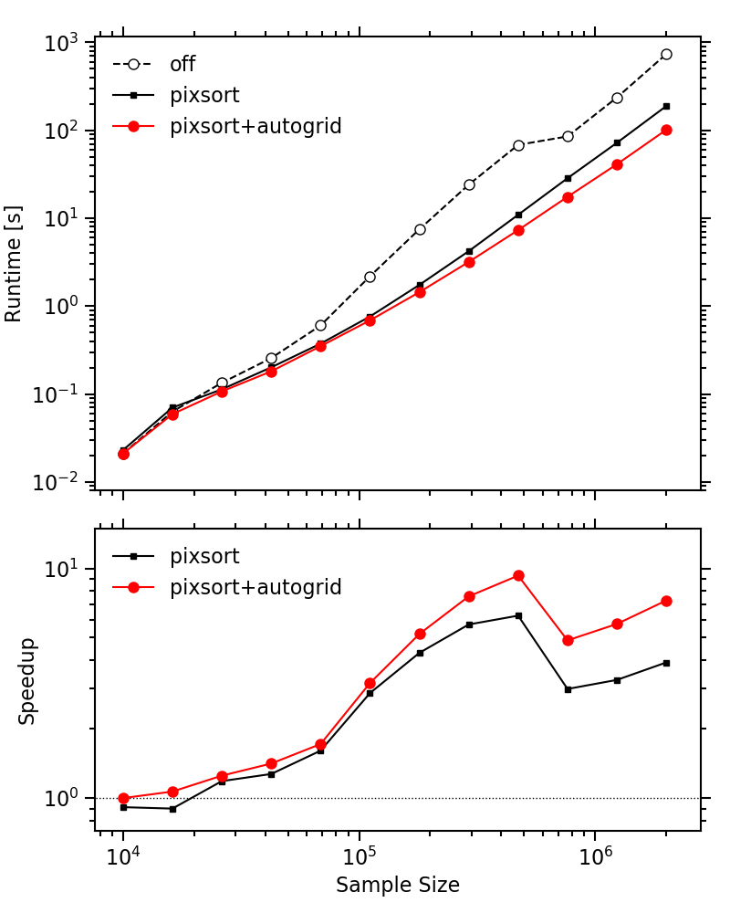
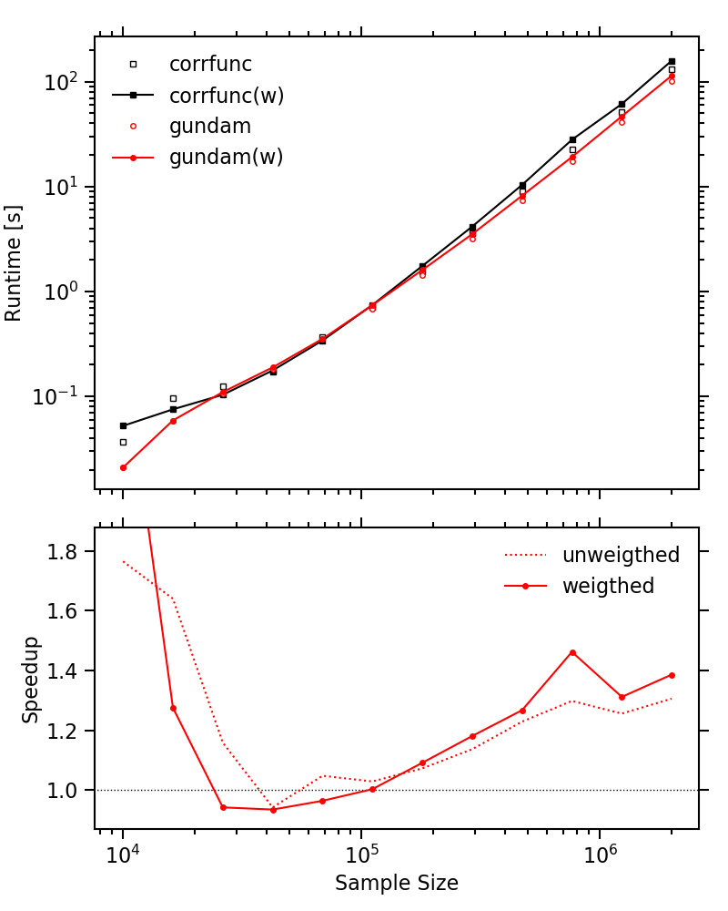

.. _performance:

***********
Performance
***********

The Gundam package is optimized both for *speed* and *usability*. Nevertheless, it
is among the fastest codes available. Below there are some benchmarks (single-thread) 
comparing run time vs size for various samples of 10^4 to 8x10^6 galaxies extracted 
from a 60x60 deg^2 light cone build from the Millennium Simulation and the 
Semi-Analytic Galaxy Evolution Model (SAGE). 

We show here the effect of sorting the data into convenient cells or *pixels* 
before counting pairs, and the effect of choosing a good grid size for samples
of increasing density.

Now we compare with one of the fastest publicity available codes 
(`corrfunc <https://github.com/manodeep/Corrfunc/>`_)
    
The equipment employed for testing is based in a four core i7-3770K 3.5GHz CPU 
(L1 cache: 32KB data + 32KB instruction, L2 cache: 256KB, L3 cache: 8MB shared)
with 16GB RAM, running with OpenSuse Linux, GNU Fortran 6.1.1 compiler and Python 
3.5.2. Compilation was performed with f2py (numpy 1.11.1) with flags {\tt march=native 
-ftree-vectorize}. We required 14 rp bins from 0.01 to 25 Mpc and 40 radial 
bins from 0 to 40 Mpc.
