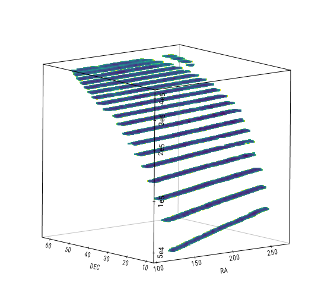

.. _pxorder:

======================
Pixel Ordering Methods
======================

To increase the performance of linked list algorithms, spatial data is divided 
in "pixels" and these pixels are sorted by different methods. The rows
of the input data table can be rearranged according to this pixel index,
so that nearby structure in real space are also close in computer memory 
space. Once input data is sorted, traversing the linked list will generate 
many more cache hits.

This is quite similar to Morton-curve or Hilbert-curve techniques 
used in computer science to map multidimensional data into a one dimensional
index.

Note these "pixels" have nothing to do with the cells used by the linked
list algorithm. The parameter :code:`pxorder` controls the method to sort the
pixels. Available options are:

- **'natural'** |br|
  Pixels are sorted in lexical order by three keys, DEC-RA-Z, in that order.
  This is usually the fastest option as it more closely matches the mechanics
  of the counting algorithm. The number of pixels are set to :code:`(mxh1,mxh2,10*mxh3)`,
  where the factor of 10 creates a slighly more fine grained ordering along the 
  redshift dimension

- **'morton_dir'** |br|
  2D Morton-curve ordering using the RA-DEC values directly, i.e. no division
  in pixels

- **'morton2'** |br|
  Pixels are sorted by 2D Morton-curve in RA-DEC

- **'morton3'** |br|
  Pixels are sorted by 3D Morton-curve in RA-DEC-Z

- **'hilbert2'** |br|
  Pixels are sorted by 2D Hilbert-curve in RA-DEC

- **'hilbert3'** |br|
  Pixels are sorted by 3D Hilbert-curve in RA-DEC-Z

Note these are experimental features mainly for testing purposes. You do not
need to fuss with these options unless you are looking for fun. Plus, in
most cases the default natural order is the fastest option.

The following images illustrate how pixel sorting rearranges a list of ra-dec
coordinates into nearby patches. The vertical axis is the index of the ra-dec 
point in the list (in log scale for clarity).

    Natural pixel ordering

.. figure:: omorton.png
    :scale: 70%
    :alt: Morton pixel ordering

    Morton pixel ordering

.. |br| raw:: html

    

   
   
.. _custRAbound:

Custom RA Boundaries
====================

The area in the sky occupied by a sample or survey can be composed of multiple 
scattered "patches" at both sides of the RA=0 limit. In order to efficiently 
grid and sort such a sample, the area enclosing all of its 
objects should be minimal, which can be difficult to find out automatically. 

For example, if a survey is composed of two equatorial 1 deg^2 patches, one 
beginning at RA=355 deg and the other beginning at RA=5 deg, the grid can extend 
from 5 to 356 deg or, more conveniently, from 355 to 6 deg. The input 
parameter ``custRAbound`` can be set to indicate such limits. In this case, 
setting ``custRAbound = [355., 6.]`` will create a much smaller grid and routines
will perform faster.

Gundam will try to guess if a sample crosses the RA=0 limit
(see :func:`gundam.cross0guess`).

